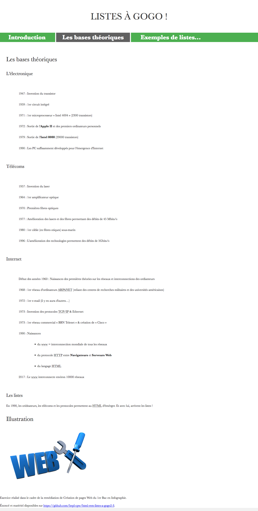
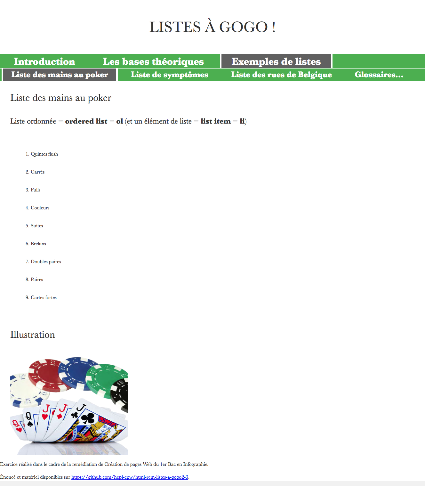
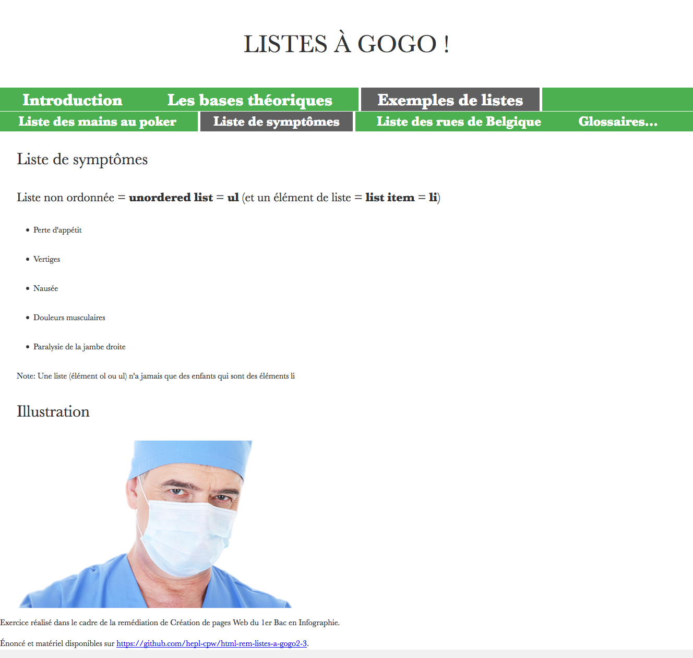
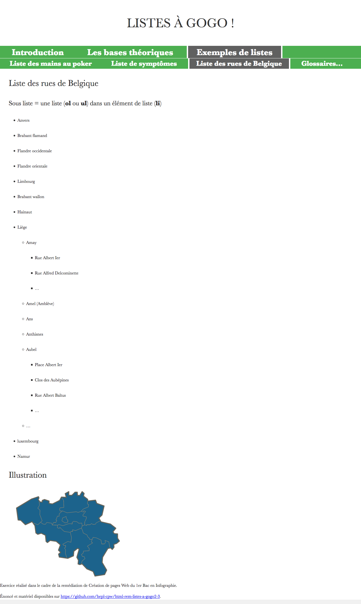
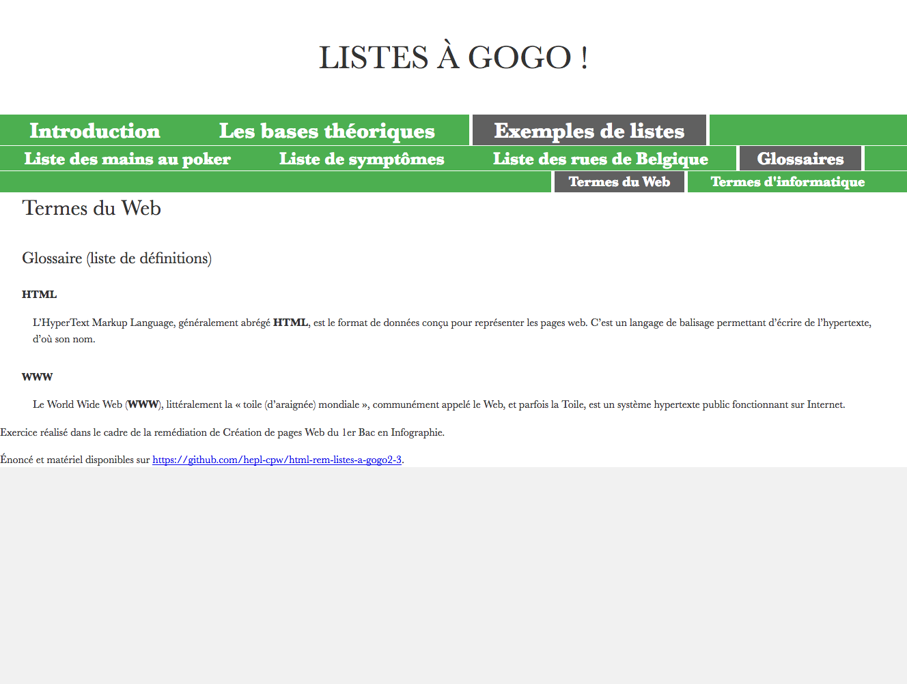
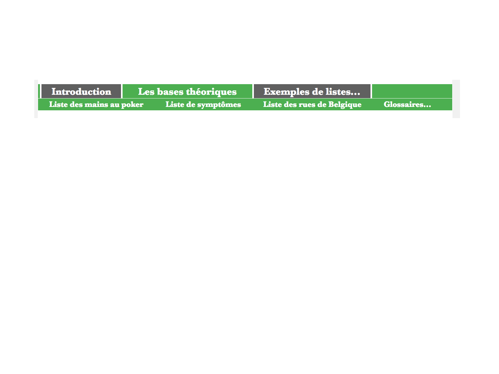
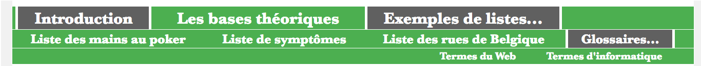

# "Listes à gogo 2/3"

> HTML exercise given at HEPL

* * *

**"Listes à gogo"** is an educational project, which will be used for `HTML` remedial courses.

**Note:** the school where the course is given, the [HEPL](http://www.provincedeliege.be/hauteecole) from Liège, Belgium, is a french-speaking school. From this point, the instruction will be in french. Sorry.

* * *

> Lors de vos cours de *web*, vous allez découvrir les langages HTML et CSS et les mettre en pratique pour apprendre à créer des pages web.  

* * *

## Listes à gogo 2/3

Vous trouverez dans ce dossier un fichier texte HTML nommée **index.html** ansi que six autres fichiers texte HTML dans le dossier **html**. Ce &laquo;&nbsp;mini-site&nbsp;&raquo; &laquo;&nbsp;Liste à gogo&nbsp;&raquo; est dédié aux listes HTML en les re-situant dans leur contexte et en présentant divers exemples.  

Les fichiers donnés correspondent à la solution de la partie 1 (disponible sur le branche &laquo;&nbsp;completed&nbsp;&raquo; de l'énoncé de la partie 1).

Il est donc tout à fait possible de réaliser cette partie 2 sans avoir fait la partie 1.

Votre but lors de cette partie 2 sur 3 est 

	- d'ajouter un menu vertical avec 2 niveaux de sous-menus grâce à des listes afin de fournir un moyen de navigation au site
	- d'ajouter des illustrations dans 5 pages du site.
	
Le menu est composé de listes et sous-listes non ordonnées et contient des liens relatifs vers les diverses pages du site. Les images utilisées (prévues dans le dossier **img**) sont trouvées également avec des chemins relatifs.

Dans la section **«&nbsp;Aide&nbsp;»** ci-dessous se trouve quelques rappels utiles concernant les chemins relatifs et les images. 

**Attention:** Il faudra ajouter *POUR CHAQUE FICHIER HTML&nbsp;!* une balise `link` avec attributs `rel` et `href` (avec un chemin relatif vers le fichier **screen.css** fourni et localisé dans le dossier **css** de cet énoncé).

* * *

## Voici les 7 rendus des différentes pages une fois l'exercice terminé.

### Rendu de **index.html**


### Rendu de **bases.html**



### Rendu de **li_mains_poker.html**



### Rendu de **li_symptomes.html**



### Rendu de **li_rues.html**



### Rendu de **li_dfn_web.html**



### Rendu de **li_dfn_info.html**


* * *

## Voici les rendus au survol des items de menus qui font apparaître un sous-menu.

### Rendu de **index.html au survol de l'item &laquo;&nbsp;Exemples de listes&nbsp;&raquo; **



### Rendu de **index.html au survol de l'item &laquo;&nbsp;Glossaires&nbsp;&raquo; **



* * *

### 1. Marche à suivre plus détaillée pour compléter les fichiers HTML

Pour vous aider, voici les étapes que vous pouvez suivre&nbsp;:

1. Dans le fichier **index.html**

	1. juste après la balise `h1`, ajouter une balise `nav` pour contenir la liste non ordonnée qui sera notre menu horizontal&nbsp;;
	
	2. lui ajouter tout d'abord une balise `h2` (car `nav` est sectionnante et appelle donc un titre, de niveau 2 dans notre cas) avec pour texte **Menu principal**
    
	3. ajouter une liste non ordonnée avec attribut d'accessibilité `role="menubar"` et 3 items de listes **Introduction**, **Les bases théoriques** et **Exemples de listes**&nbsp;;

	4. ces 3 items de liste auront chacun leur attribut d'accessibilité `role="menuitem"`&nbsp;;

	5. l'item de liste &laquo;&nbsp;courant&nbsp;&raquo; (**Introduction**) doit posséder une classe **current** pour s'afficher différemment&nbsp;;
	
	6. les textes **Introduction**, et **Exemples de listes** ne sont pas cliquables mais doivent être balisés d'une ancre (balise `a` avec attribut `href="#"`) afin d'être (plus facilement) stylés comme les autres menus&nbsp;;
	
	7. le texte **Les bases théoriques** doit être rendu cliquable au moyen d'une balise `a` avec attributs `href` et `title` qui mène vers le fichier **bases.html** situé dans le dossier **html** (via un chemin relatif)&nbsp;;
	
	8. ajouter le sous-menu après la balise `a` du menu **Exemples de listes**; il s'agit d'une liste non ordonnée avec attribut d'accessibilité `role="menu"` et 4 items de listes **Liste des mains au poker**, **Liste de symptômes**, **Liste des rues de Belgique** et **Glossaires**&nbsp;;

	9. ces 4 items de liste auront chacun leur attribut d'accessibilité `role="menuitem"`&nbsp;;

	10. les textes **Liste des mains au poker**, **Liste de symptômes** et **Liste des rues de Belgique** doivent être rendus cliquables au moyen de balises `a` avec attributs `href` et `title` qui mènent respectivement vers les fichier **li_mains_poker.html**, **li_symptomes.html** et **li_rues.html**, situés dans le dossier **html** (via des chemins relatifs)&nbsp;;

	11. le texte **Glossaires** n'est pas cliquable mais doit être balisé d'une ancre (balise `a` avec attribut `href="#"`) afin d'être (plus facilement) stylé comme les autres menus&nbsp;;

	12. ajouter le sous-sous-menu après la balise `a` du menu **Glossaires**; il s'agit d'une liste non ordonnée avec attribut d'accessibilité `role="menu"` et 2 items de listes **Termes du Web** et **Termes d'informatique**&nbsp;;

	13. ces 2 items de liste auront chacun leur attribut d'accessibilité `role="menuitem"`&nbsp;;

	14. les textes **Termes du Web** et **Termes d'informatique** doivent être rendus cliquables au moyen de balises `a` avec attributs `href` et `title` qui mènent respectivement vers les fichier **li_dfn_web.html** et **li_dfn_info.html**, situés dans le dossier **html** (via des chemins relatifs)&nbsp;;
	
	15. Afin d'améliorer l'accessibilité du site, on peut placer un &laquo;&nbsp;lien d'évitement&nbsp;&raquo; au tout début dans la balise `nav`; il s'agit d'une balises `a` entourant le texte `Aller au contenu` avec attributs `href="#content"` (pour qu'une personne qui surfe avec un lecteur vocal puisse passer directement au contenu de la page sans devoir écouter l'entièreté du menu d'abord) et `class="skip"` (pour que le fichier CSS fourni masque visuellement ce lien d'évitement inutile pour les personnes qui surfent avec un navigateur &laquo;&nbsp;classique&nbsp;&raquo;)&nbsp;;
	
	16. Pour que cette technique du lien d'évitement fonctionne, il faut encore ajouter un attribut `id="content"` à la balise `main` (afin que le lien vers `#content` mène directement vers la lecture de cette balise `main`).

2. Dans le fichier **bases.html** (et après avoir bien vérifier que le menu fonctionne bien pour la page d'index)

	1. juste après la balise `h1`, copier-coller la balise `nav` complète de la page **index.html**&nbsp;;

	2. déplacer la classe **current**; celle-ci ne doit plus s'appliquer à l'item de menu **Introduction**, mais bien à l'item **Les bases théoriques** (qui correspond au fichier actuel **bases.html**)&nbsp;;
	
	3. rendre cliquable le texte **Introduction** au moyen d'une balise `a` avec attributs `href` et `title` qui mène vers le fichier **index.html** situé *dans le dossier parent* (via un chemin relatif)&nbsp;;

	4. rendre non cliquable le texte **Les bases théoriques** en modifiant l'attribut `href` de la balise `a` (avec la valeur `#`)&nbsp;;
	
	5. adapter les chemins relatifs des autres liens (**Liste des mains au poker**, **Liste de symptômes**, **Liste des rues de Belgique**, **Termes du Web** et **Termes d'informatique**) car ceux-ci ne se trouvent pas dans un sous dossier **html** mais bien *dans le même dossier* que le fichier actuel (**bases.html**)&nbsp;;
	
	6. pour des raisons de mise en page (CSS) différente des autres, ce fichier **bases.html** doit utiliser un attribut `id` spécifique `bases` au niveau de sa balise `main`&nbsp;;

	7. par voie de conséquence, il faut modifier la valeur d'attribut `#content` du lien d'évitement, celui-ci doit bien entendu s'adapter et devenir `#bases`.

3. Dans le fichier **li_mains_poker.html** (et après avoir bien vérifier que le menu fonctionne bien pour la page **bases.html**)

	1. juste après la balise `h1`, copier-coller la balise `nav` complète de la page **bases.html**&nbsp;;
	
	2. ajouter l'identifiant `content` à la balise `main` et modifier la valeur d'attribut `#content` du lien d'évitement, celui-ci doit bien entendu s'adapter et devenir `#content`&nbsp;;

	3. déplacer la classe **current**; celle-ci ne doit plus s'appliquer à l'item de menu **Les bases théoriques**, mais bien à 2 items&nbsp;:
	
		- l'item **Liste des mains au poker** (qui correspond au fichier actuel **li_mains_poker.html**) qui pourra donc être stylé différemment, mais aussi&nbsp;;
		- l'item **Exemples de listes** (qui correspond au menu parent et qui pourra donc être stylé de la même manière que le menu courant).
	
	4. rendre cliquable le texte **Les bases théoriques** en modifiant l'attribut `href` de la balise `a` pour que celle-ci mène (via un chemin relatif) vers le fichier **bases.html** situé dans le même dossier que le fichier actuel (**li_mains_poker.html**)&nbsp;;

	5. rendre non cliquable le texte **Liste des mains au poker** en modifiant l'attribut `href` de la balise `a` (avec la valeur `#`).

4. Dans le fichier **li_symptomes.html** (et après avoir bien vérifier que le menu fonctionne bien pour la page **li_mains_poker.html**)

	1. juste après la balise `h1`, copier-coller la balise `nav` complète de la page **li_mains_poker.html**&nbsp;;
	
	2. déplacer une des 2 classes **current**; celle-ci doit toujours s'appliquer au parent **Exemples de listes**, mais ne doit plus s'appliquer à l'item de menu **Liste des mains au poker**, mais bien à l'item **Liste de symptômes** (qui correspond au fichier actuel **li_symptomes.html**)&nbsp;;

	3. rendre cliquable le texte **Liste des mains au poker** en modifiant l'attribut `href` de la balise `a` pour que celle-ci mène (via un chemin relatif) vers le fichier **li_mains_poker.html** situé dans le même dossier que le fichier actuel (**li_symptomes.html**)&nbsp;;

	4. rendre non cliquable le texte **Liste de symptômes** en modifiant l'attribut `href` de la balise `a` (avec la valeur `#`).

5. Dans le fichier **li_rues.html** (et après avoir bien vérifier que le menu fonctionne bien pour la page **li_symptomes.html**)

	1. juste après la balise `h1`, copier-coller la balise `nav` complète de la page **li_symptomes.html**&nbsp;;
	
	2. déplacer une des 2 classes **current**; celle-ci doit toujours s'appliquer au parent **Exemples de listes**, mais ne doit plus s'appliquer à l'item de menu **Liste de symptômes**, mais bien à l'item **Liste des rues de Belgique** (qui correspond au fichier actuel **li_rues.html**)&nbsp;;

	3. rendre cliquable le texte **Liste de symptômes** en modifiant l'attribut `href` de la balise `a` pour que celle-ci mène (via un chemin relatif) vers le fichier **li_symptomes.html** situé dans le même dossier que le fichier actuel (**li_rues.html**)&nbsp;;

	4. rendre non cliquable le texte **Liste des rues de Belgique** en modifiant l'attribut `href` de la balise `a` (avec la valeur `#`).

6. Dans le fichier **li_dfn_web.html** (et après avoir bien vérifier que le menu fonctionne bien pour la page **li_rues.html**)

	1. juste après la balise `h1`, copier-coller la balise `nav` complète de la page **li_rues.html**&nbsp;;
	
	2. modifier les classes **current**; celle-ci ne doit plus s'appliquer à l'item de menu **Liste des rues de Belgique**, mais bien à 2 items&nbsp;:
	
		- l'item **Termes du Web** (qui correspond au fichier actuel **li_dfn_web.html**) qui pourra donc être stylé différemment, mais aussi&nbsp;;
		- l'item **Glossaires** (qui correspond au menu parent et qui pourra donc être stylé de la même manière que le menu courant).

	3. rendre cliquable le texte **Liste des rues de Belgique** en modifiant l'attribut `href` de la balise `a` pour que celle-ci mène (via un chemin relatif) vers le fichier **li_rues.html** situé dans le même dossier que le fichier actuel (**li_rues.html**)&nbsp;;

	4. rendre non cliquable le texte **Termes du Web** en modifiant l'attribut `href` de la balise `a` (avec la valeur `#`).

7. Dans le fichier **li_dfn_info.html** (et après avoir bien vérifier que le menu fonctionne bien pour la page **li_dfn_web.html**)

	1. juste après la balise `h1`, copier-coller la balise `nav` complète de la page **lli_dfn_web.html**&nbsp;;
	
	2. modifier les classes **current**; celle-ci doit toujours s'appliquer aux parents **Exemples de listes** et **Glossaires**, mais ne doit plus s'appliquer à l'item de menu **Termes du Web**, mais bien à l'item **Termes d'informatique** (qui correspond au fichier actuel **li_dfn_info.html**)&nbsp;;

	3. rendre cliquable le texte **Termes du Web** en modifiant l'attribut `href` de la balise `a` pour que celle-ci mène (via un chemin relatif) vers le fichier **li_dfn_web.html** situé dans le même dossier que le fichier actuel (**li_dfn_info.html**)&nbsp;;

	4. rendre non cliquable le texte **Termes d'informatique** en modifiant l'attribut `href` de la balise `a` (avec la valeur `#`)&nbsp;;
	
	5. vérifier que le menu fonctionne bien pour cette page **li_dfn_web.html**.
	
8. Ajouter un titre (`h2`) &laquo;&nbsp;Illustrations&nbsp;&raquo; suivi d'une balises `figure` contenant la bonne image dans les pages **index.html**, **bases.html**, **li_mains_poker.html**, **li_symptomes.html** et **li_rues.html** en vous référant aux rendus données ci-avant dans l'énoncé ainsi qu'à la section **«&nbsp;Aide&nbsp;»** ci-dessous.
	

### 2. Aides

#### 2. 1. Les chemins relatifs

a. un chemin relatif est toujours relatif au dossier du fichier dans lequel on est en train d'écrire ce chemin relatif.

b. pour créer, dans un fichier **fichA.html**, un lien relatif vers un fichier **fichB.html** qui se trouve dans le même dossier que **fichA.html**&nbsp;:

```html
    <a href="./fichB.html" title="Visiter le fichier &laquo;&nbsp;B&nbsp;&raquo;">Fichier &laquo;&nbsp;B&nbsp;&raquo;</a> 
```

- en effet, dans un chemin relatif&nbsp;: le `.` désigne le &laquo;&nbsp;dossier courant&nbsp;&raquo; (du fichier dans lequel on ajoute une balise `a`)&nbsp;;

- le chemin `./fichB.html` peut donc se lire &laquo;&nbsp;partant du dossier dans lequel se trouve le fichier dans lequel se lien est écrit, on reste dans ce dossier et l'on y cherche le fichier **fichB.html**&nbsp;&raquo;&nbsp;;

c. pour créer, dans un fichier **fichA.html**, un lien relatif vers un fichier **fichB.html** qui se trouve dans un sous-dossier **sd**&nbsp;:

```html
    <a href="./sd/fichB.html" title="Visiter le fichier &laquo;&nbsp;B&nbsp;&raquo;">Fichier &laquo;&nbsp;B&nbsp;&raquo;</a> 
```

- en effet, dans un chemin relatif&nbsp;: le `/` signifie qu'on doit accéder au sous-dossier spécifier juste après (le `/`)&nbsp;;

- le chemin `./sd/fichB.html` peut donc se lire &laquo;&nbsp;partant du dossier dans lequel se trouve le fichier dans lequel se lien est écrit, on reste dans ce dossier et l'on y cherche le sous-dossier **sd** dans lequel on cherche le fichier **fichB.html**&nbsp;&raquo;&nbsp;;


d. pour créer, dans un fichier **fichA.html**, un lien relatif vers un fichier **fichB.html** qui se trouve dans le dossier parent&nbsp;:

```html
    <a href="../fichB.html" title="Visiter le fichier &laquo;&nbsp;B&nbsp;&raquo;">Fichier &laquo;&nbsp;B&nbsp;&raquo;</a> 
```

- en effet, dans un chemin relatif&nbsp;: les `..` désigne le &laquo;&nbsp;dossier parent&nbsp;&raquo;&nbsp;;

- le chemin `../fichB.html` peut donc se lire &laquo;&nbsp;partant du dossier dans lequel se trouve le fichier dans lequel se lien est écrit, on remonte au dossier parent de ce dossier et l'on y cherche le fichier **fichB.html**&nbsp;&raquo;&nbsp;;


e. pour créer, dans un fichier **fichA.html**, un lien relatif vers un fichier **fichB.html** qui se trouve dans un autre dossier **ad**, situé à côté du dossier de **fichA.html**&nbsp;:

```html
    <a href="../ad/fichB.html" title="Visiter le fichier &laquo;&nbsp;B&nbsp;&raquo;">Fichier &laquo;&nbsp;B&nbsp;&raquo;</a> 
```

- le chemin `../ad/fichB.html` peut donc se lire &laquo;&nbsp;partant du dossier dans lequel se trouve le fichier dans lequel se lien est écrit, on remonte au dossier parent de ce dossier et l'on y cherche le dossier **ad** dans lequel on cherche le fichier **fichB.html**&nbsp;&raquo;&nbsp;;


f. on peut remonter et redescendre (et donc se &laquo;&nbsp;balader&nbsp;&raquo;) dans une arborescence facilement avec `.`, `/` et `..`&nbsp;; par exemples&nbsp;:

```html
    <a href="../../dossX/dossY/fichB.html" title="Visiter le fichier &laquo;&nbsp;B&nbsp;&raquo;">Fichier &laquo;&nbsp;B&nbsp;&raquo;</a> 
```

```html
    <a href="./sousdoss1/sousdoss2/fichB.html" title="Visiter le fichier &laquo;&nbsp;B&nbsp;&raquo;">Fichier &laquo;&nbsp;B&nbsp;&raquo;</a> 
```

#### 2. 2. Les images d'illustrations&nbsp;:

- peuvent être insérées avec les balises `figure`, `figcaption` et `img` en HTML avec une légende lisible directement. Par exemple, comme ceci&nbsp;:

```html
	<figure>
		
		<figcaption>Illustration du communisme soviétique</figcaption>
	</figure>
```

- ou elles peuvent être insérées avec les balises `figure` et `img` en HTML avec une &laquo;&nbsp;légende&nbsp;&raquo; lisible uniquement au survol du curseur de la souris. Par exemple, comme ceci&nbsp;:

```html
	<figure>
		
	</figure>
```

* * *

Bon travail !